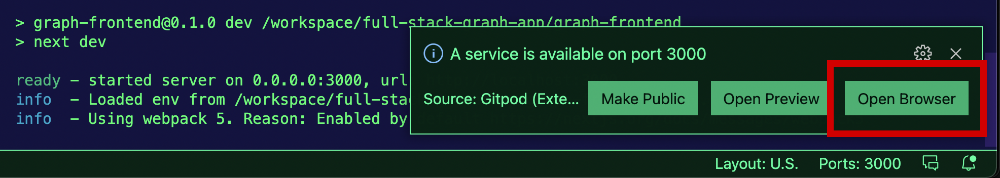

## Query NFT data with a Subgraph in your Browser

This is an example app to show you how to [query data from a Subgraph](https://thegraph.com/docs/developer/query-the-graph#querying-from-your-app) from a client-side application.

The project includes a front-end application built with Next.js that queries NFT data from a subgraph that indexes data from the [Foundation smart contracts](https://fnd.dev/).

## Deployment options

### 1. Automate with Gitpod in Browser 

You can auto-deploy this project with Gitpod in your browser by clicking here:

[](https://gitpod.io/#github.com/graphprotocol/full-stack-graph-app)

Once the setup is complete, the app will be started and you should be able to open it and view it:



### 2. Local Deployment on your Machine 

To deploy locally, follow these steps:

1. Clone the project

```sh
git clone git@github.com:graphprotocol/full-stack-graph-app.git
```

2. Change into the __graph-frontend__ directory and install the dependencie:

```sh
cd full-stack-graph-app/graph-frontend

npm install
```

3. Start the server:

```sh
npm run dev
```

4. Optional

If you have an endpoint that you'd like to use, update __.env.local__ with your subgraph endpoint.

### 3. Deploying your own Subgraph 

1. Change into the __foundation-subgraph__ directory and install the dependency:

```sh
cd foundation-subgraph

npm install
```

2. Create a new Subgraph in [Subgraph Studio](https://thegraph.com/studio/)

3. Configure your deploy key

```sh
graph auth --studio
```

4. Deploy your subgraph

```sh
graph deploy --studio <subgraph-name>
```

5. Update the API endpoint environment variable in __graph-frontent/.env.local__
